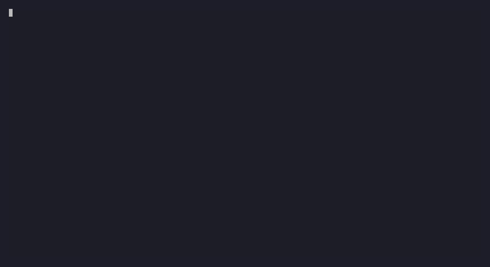

<p align="center">
  <h1 align="center">muonroi-cli</h1>
  <p align="center">
    <em>An AI coding agent where models argue with each other before answering.</em>
  </p>
  <p align="center">
    <a href="https://github.com/muonroi/muonroi-cli/actions/workflows/ci-matrix.yml"></a>
    <a href="https://www.npmjs.com/package/muonroi-cli"></a>
    
    
    
  </p>
</p>

---

> Routes each task to the optimal model, runs adversarial multi-model debates for high-stakes decisions, and persists behavioral memory across sessions. Bring your own API keys. Total cost: ~$5/month.

<p align="center">
  
</p>

## Quick Start

```bash
bun add -g muonroi-cli
muonroi-cli
```

Or without Bun:

```bash
curl -fsSL https://raw.githubusercontent.com/muonroi/muonroi-cli/main/install.sh | bash
```

Role routing and council debates require at least two providers:

```json
// ~/.muonroi-cli/user-settings.json
{
  "apiKey": "sk-ant-your-key",
  "providers": {
    "anthropic": { "apiKey": "sk-ant-..." },
    "deepseek":  { "apiKey": "sk-..." }
  },
  "roleModels": {
    "leader":    "claude-sonnet-4-6",
    "implement": "deepseek-v4-flash",
    "verify":    "claude-sonnet-4-6",
    "research":  "deepseek-v4-flash"
  }
}
```

## Documentation

Full documentation at **[docs.muonroi.com/docs/cli](https://docs.muonroi.com/docs/cli/overview)**

| Topic | Link |
|---|---|
| Overview & architecture | [CLI Overview](https://docs.muonroi.com/docs/cli/overview) |
| Multi-Model Council | [Council Debate Guide](https://docs.muonroi.com/docs/cli/guides/council-debate) |
| Prompt Intelligence Layer | [PIL Pipeline Guide](https://docs.muonroi.com/docs/cli/guides/pil-pipeline) |
| Experience Engine | [Experience Engine Guide](https://docs.muonroi.com/docs/cli/guides/experience-engine) |
| Agent Harness | [Agent Harness Guide](https://docs.muonroi.com/docs/cli/guides/agent-harness) |
| Settings reference | [CLI Settings Reference](https://docs.muonroi.com/docs/cli/reference/cli-settings-reference) |
| Commands reference | [Commands Reference](https://docs.muonroi.com/docs/cli/reference/commands-reference) |
| Providers reference | [Providers Reference](https://docs.muonroi.com/docs/cli/reference/providers-reference) |

## Development

```bash
git clone https://github.com/muonroi/muonroi-cli.git
cd muonroi-cli && bun install

bun run dev           # run from source
bun run typecheck     # type check
bun run test          # vitest
bun run lint          # biome check
bun run build:binary  # standalone binary
```

## License

MIT
